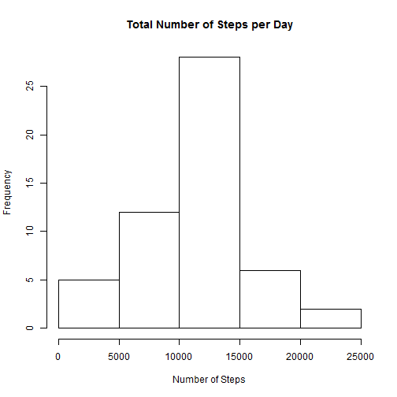
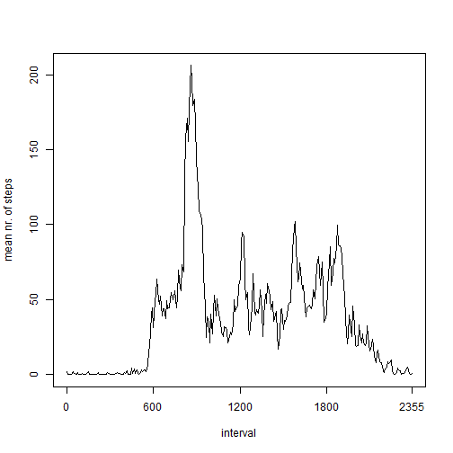
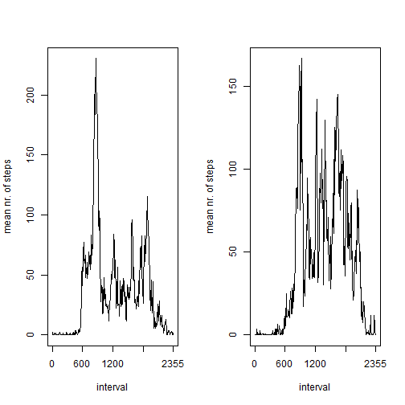

### Loading and preprocessing the data

The following code sets the working directory and loads the data set.


```r
setwd("c:/users/Fabian/desktop/Coursera/")
dat <- read.csv("activity.csv", sep = ",")
```

We need to make sure that the _date_ column is recognized as a date variable (rather than a factor):


```r
dat$date <- as.Date(dat$date)
```

Show the first three entries as an illustration:


```r
head(dat, 3)
```

```
##   steps       date interval
## 1    NA 2012-10-01        0
## 2    NA 2012-10-01        5
## 3    NA 2012-10-01       10
```

### What is mean total number of steps taken per day?

To answer this question, we first compute the total number of steps for *every* day in the sample. As a preliminary, we produce a version of the data set that contains only the complete data.  


```r
datComplete <- subset(dat, !is.na(steps))
```

Again show the first three entries as an illustration:


```r
head(datComplete, 3)
```

```
##     steps       date interval
## 289     0 2012-10-02        0
## 290     0 2012-10-02        5
## 291     0 2012-10-02       10
```

Note that the first day with a non-NA entry is October 2, 2012 (October 1, 2012 only has NA entries). We next use R's _aggregate_ function to produce a data frame which contains the total number of steps for every day that appears in the (complete) sample.


```r
# Sum of steps for every day in the complete sample 
stepsPerDay <- aggregate(datComplete$steps, by = list(datComplete$date), FUN = sum)
# Rename the columns of the resulting data frame
names(stepsPerDay) <- c("date", "totalSteps")
```

We next plot a histogram for the total number of steps per day. 


```r
hist(stepsPerDay$totalSteps, main = "Total Number of Steps per Day", xlab = "Number of Steps")
```

 

Using _summary_ produces the mean and median of the total number of steps per day:


```r
summary(stepsPerDay$totalSteps)
```

```
##    Min. 1st Qu.  Median    Mean 3rd Qu.    Max. 
##      41    8840   10800   10800   13300   21200
```

### What is the average daily activity pattern?

We again use _summary_ to compute the average number of steps for every 5-minute interval in the data set.


```r
# Mean (!) nr of steps for every interval in the complete sample 
stepsPerInterval <- aggregate(datComplete$steps, by = list(datComplete$interval), FUN = mean)
# Rename columns of the data frame
names(stepsPerInterval) <- c("interval", "meanSteps")
```

Plot the mean number of steps across intervals:


```r
# Base plot without x axis
plot(stepsPerInterval$meanSteps, xlab = "interval", ylab = "mean nr. of steps", type = "l", xaxt = "n")
# Add an x axis
labels <- c(0, 600, 1200, 1800, 2355)
at <- sapply(labels, function(z) which(stepsPerInterval$interval == z))
axis(1, at = at, labels = labels)
```

 

The following line of code finds (and prints) the interval for which the average number of steps is highest:


```r
stepsPerInterval$interval[which.max(stepsPerInterval$meanSteps)]
```

```
## [1] 835
```

Thus, the mean number of steps is highest in the interval starting at 8:35 in the morning.

### Imputing missing values

Compute and show the number of NAs in original data set


```r
sum(is.na(dat$steps))
```

```
## [1] 2304
```

My imputation strategy is to use the mean number of steps for the five-minute interval of the missing observation. 


```r
# Copy data frame, imputed values to be added
datImpute <- dat
# All intervals that occur in the sample
ints <- sort(unique(datComplete$interval))
# Loop over intervals
for (ii in ints){
  datImpute$steps[is.na(dat$steps) & (dat$interval == ii)] <- subset(stepsPerInterval, interval == ii)$meanSteps
}
```

Compute total number of steps per day for the _imputed_ dataset. 


```r
# Sum of steps for every day in the imputed sample 
stepsPerDayImpute <- aggregate(datImpute$steps, by = list(datImpute$date), FUN = sum)
# Rename the columns of the resulting data frame
names(stepsPerDayImpute) <- c("date", "totalSteps")
# Show summary statistics
summary(stepsPerDayImpute$totalSteps)
```

```
##    Min. 1st Qu.  Median    Mean 3rd Qu.    Max. 
##      41    9820   10800   10800   12800   21200
```

### Are there differences in activity patterns between weekdays and weekends?

Create a factor variable which is TRUE for a weekend (weekday either "Samstag" or "Sonntag", which is Saturday and Sunday in German). 


```r
# Create variable
datImpute$weekend <- as.factor(weekdays(datImpute$date) %in% c("Samstag", "Sonntag"))
# Illustration
head(datImpute, 3)
```

```
##    steps       date interval weekend
## 1 1.7170 2012-10-01        0   FALSE
## 2 0.3396 2012-10-01        5   FALSE
## 3 0.1321 2012-10-01       10   FALSE
```

Summarize mean steps for each interval, separately for weekdays and weekends.


```r
# Use aggregate function again
stepsPerInterval2 <- aggregate(datImpute$steps, by = list(datImpute$interval, datImpute$weekend), mean)
# Rename columns of resulting data frame
names(stepsPerInterval2) <- c("interval", "weekend", "meanSteps")
```

Make plot


```r
par(mfrow = c(1, 2))
# First plot
plot(subset(stepsPerInterval2, weekend == FALSE)$meanSteps, xlab = "interval", ylab = "mean nr. of steps", type = "l", xaxt = "n")
axis(1, at = at, labels = labels)
plot(subset(stepsPerInterval2, weekend == TRUE)$meanSteps, xlab = "interval", ylab = "mean nr. of steps", type = "l", xaxt = "n")
axis(1, at = at, labels = labels)
```

 

The plots suggest that the activity pattern is indeed different for weekends than weekdays: For weekdays, activity reaches a clear peak in the morning hours around 8.30, and drops sharply thereafter. For weekends, activity is _more_ evenly distributed during daytime (ca. 8.00 - 19.00). As a common feature of both weedays and weekends, the plots show that activity is almost zero at night (0.00 - 6.00), which seems plausible. 
